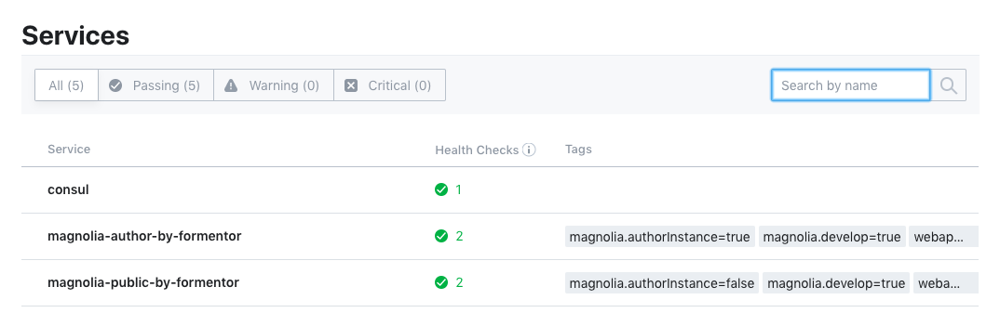
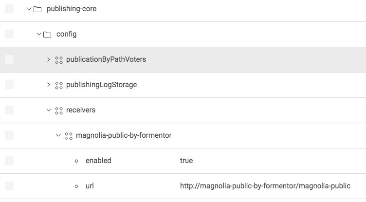
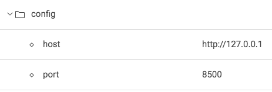
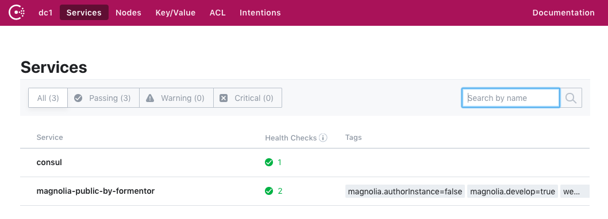

# Magnolia Cloud Service - Service Discovery

Registro magnolia como instancia de servicio en Service Discovery 

## Features
Health indicator GET /.rest/health consumido por Service Discovery para determinar el estado de la instancia del servicio  

~~~~
{
    "status": "UP"
}
~~~~
Registro automático de magnolia como instancia de servicio en Service Discovery  

Endpoints para registrar y desregistrar magnolia de forma manual  
`POST /.rest/magnolia-cloud-service/register`
`POST /.rest/magnolia-cloud-service/deregister`

Configuración de la url de *receivers* en *publishing module* con el nombre del servicio en lugar de la IP. De esta forma podemos crear y destruir instancias de magnolia public sin necesidad de configurar magnolia author.
> Si el dominio no está registrado como servicio, la publicación sigue el procedimiento *as usual*  

Integración con [Consul](https://www.consul.io/ "Consul") v1.4.3

## Usage
El interfaz com.formentor.magnolia.cloud.ServiceDiscovery especifica la implementación del servicio de registro de magnolia en un sistema Service Discovery  

~~~~
public interface ServiceDiscovery<T> {
    boolean registerService();
    boolean deRegisterService();
    boolean deRegisterService(T service);
    boolean registerService(T service);
    List<ServiceInstance> getInstances(String serviceName);
}
~~~~
Puede ser empleado cualquier servicio de Service Discovery implementando el interfaz anterior.

####Configuración
**Nombre del servicio**  

El property *magnolia.cloud.appName* de magnolia indica el servicio con que se registran las instancias de magnolia   

~~~~
# Name used as a cloud service
magnolia.cloud.appName=magnolia-public-by-formentor
~~~~

**Consul**  
Consul se configura en la configuración del propio módulo  

 
**Receiver en Publishing core**  
El módulo implementa DefaultSender para sustituir el dominio de la url de los receivers por dominio real del servicio.
Si el dominio no está registrado como servicio, entonces emplea la url tal cual.

## Demo
El modulo incluye un boostrap con la configuración de una instalación estándar de Consul. A continuación explico como probarlo  

1- Instalar consul siguiendo las instrucciones de la web de consul (es muy simple) https://learn.hashicorp.com/consul/getting-started/install

2- Arrancar Consul
~~~~
$ consul agent -server -bootstrap-expect=1 -data-dir=./consul-server-data -node=sever-one -domain domain_name -bind 127.0.0.1 -enable-script-checks=true -ui
~~~~

3- Arrancar magnolia public (¿existe algún motivo para registrar magnolia-author salvo auditar su estado?)

4- Tras el arranque, magnolia public estará registrado como instancia del servicio cuyo nombre está indicado en *magnolia.cloud.appName*
Los servicios pueden ser consultados en la consola administrativa de consul  
To see a page demonstrating this component, open the Pages app in Magnolia AdminCentral and import the files in `_dev/demos`. (Import it directly at the root of the tree to see an example of the included css styling.)

**NOTA**
>Por supuesto no es óptimo consultar el dominio de un servicio vía REST por tiempo de latencia etc. Es responsabilidad
del Service discovery resolverlo. En el caso de Consul la recomendación es desplegar un agente consul en el mismo servidor o pod del servicio.

## Contribute to the Magnolia component ecosystem
It's easy to create components for Magnolia and share them on github and npm. I invite you to do so and join the community. Let's stop wasting time by developing the same thing again and again, rather let's help each other out by sharing our work and create a rich library of components.

Just add `magnolia-light-module` as a keyword to npm's package.json to make them easy to find and use on npm.

## License

MIT

## Contributors

Formentor Studio, http://formentor-studio.com/

Joaquín Alfaro, @Joaquin_Alfaro